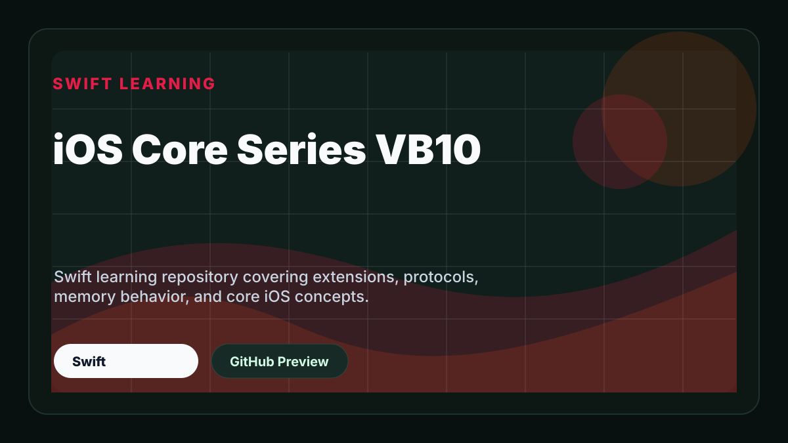

# iOS Core Series VB10

Swift learning repository covering extensions, protocols, memory behavior, and core iOS concepts.

## Preview

  

> Note: Some preview images may look slightly blurry due to screenshot compression. Thanks for your understanding.

## Project Type

Swift Learning

## Tech Stack

- Swift

## Getting Started

Open the project in Xcode and run it on a simulator or physical device.
